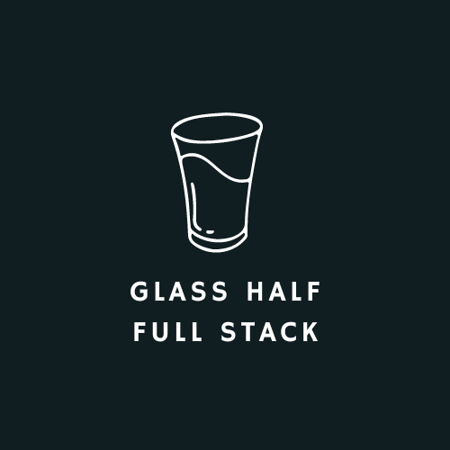
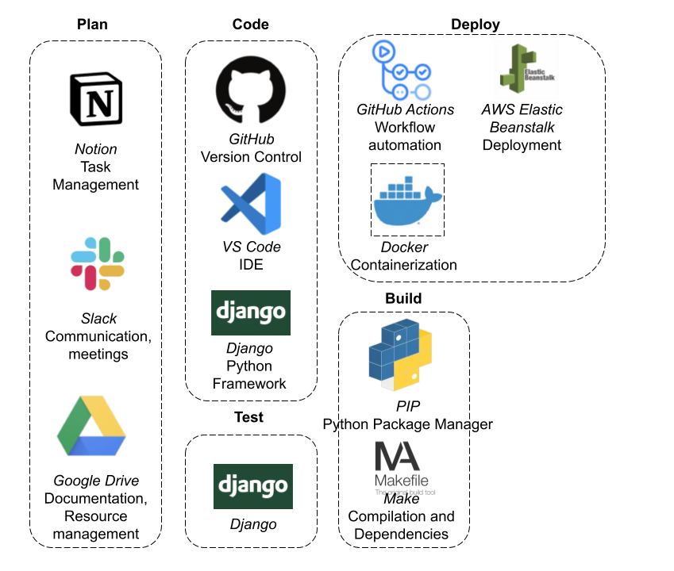
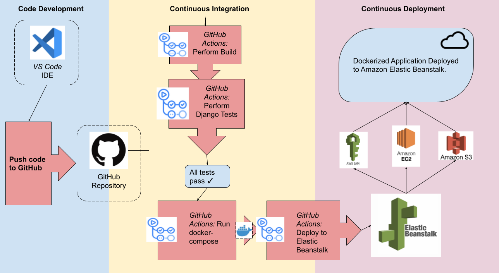
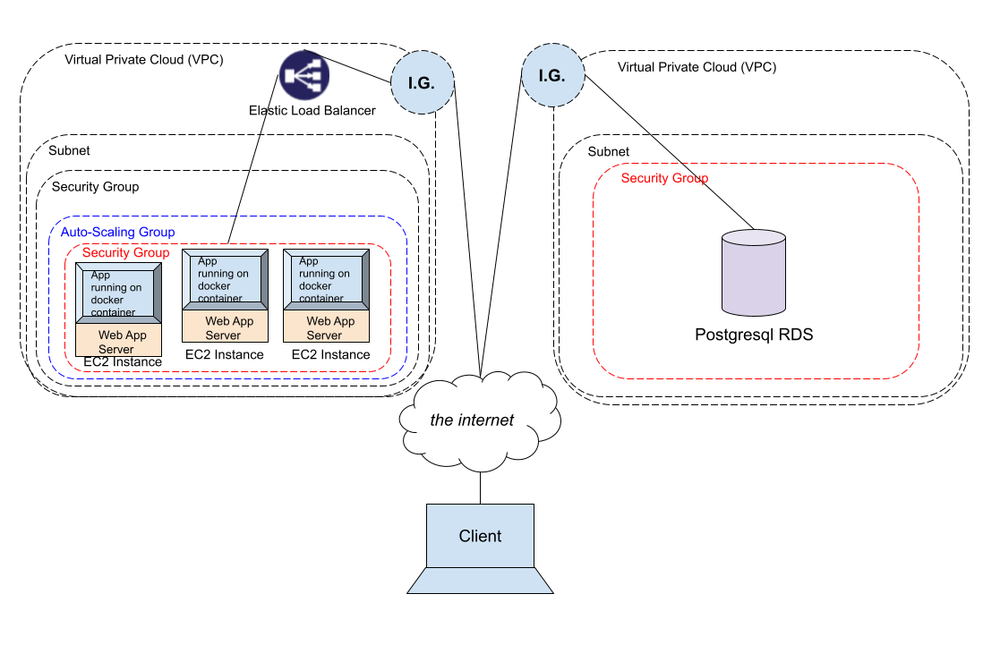

<!-- PROJECT LOGO -->
 

<h2 align="center">Pear Timer</h3>

  
Take charge of your productivity.
     
    <!-- TODO: add link to github repo -->
    <a href="https://github.com/landa44/todoTeam2"><strong>Explore the docs »</strong></a>
     
     
    <a href="http://todoteam2app-env.eba-77m4zjcb.us-east-1.elasticbeanstalk.com">View Demo</a>
    ·
    <!-- TODO: add link to github repo issues-->
    <a href="https://github.com/landa44/todoTeam2/issues">Report Bug</a>
    ·
    <!-- TODO: add link to github repo issues-->
    <a href="https://github.com/landa44/todoTeam2/issues">Request Feature</a>
  

<!-- TABLE OF CONTENTS -->

## Table of Contents

  <ol>
    <li>
      <a href="#about-the-project">About The Project</a>
      <ul>
	<li><a href="#built-with">Built With</a></li>     
        <li><a href="#features">Features</a></li>
        <li><a href="#architecture-diagram">Architecture Diagram</a></li>
      </ul>
    </li>
    <li><a href="#local-installation">Local Installation</a></li>
    <li><a href="#web-deployment">Web Deployment</a></li> 
    	<li><a href="#demo">Demo</a></li>
	<li><a href="#acknowledgments">Acknowledgments</a></li>
	<li><a href="#authors">Authors</a></li>
  </ol>

<!-- ABOUT THE PROJECT -->

## About The Project

The Pear Timer is a prodcutivity app for developers looking to organize their tasks and work smart. Pear Timer brings together research-backed features that will boost your productivity: a pomododoro timer, custimizable todo list, and more--all inside a dashboard unique to your account. Take charge of your productivity and join Pear Timer today!

(<a href="#readme-top">back to top</a>)

<!--BUILT WITH -->

## Built With

### Tools

- [Amazon Web Services](https://aws.amazon.com/)
  - AWS IAM (Identity Access Management)
  - Amazon RDS (Relational Databse System)
  - Amazon EBS (Elastic Bean Stalk)
  - Amazon EC2 (Elastic Compute Cloud)
<!--TODO add/rm tools? -->
- SOME SORT OF AUTHENTICATION TOOL, I ASSUME
- [Visual Studio Code](https://code.visualstudio.com/)
- [GitHub Actions](https://github.com/features/actions)
- [Docker](https://www.docker.com/)

### Technologies

- [Django Java Framework](https://www.djangoproject.com/)
- [HTML](https://html.spec.whatwg.org/)
- [CSS](https://www.w3.org/Style/CSS/)
- [JavaScript](https://www.javascript.com/)
- [React.js](https://reactjs.org/)
- [Node.js](https://nodejs.org/en/)
- [npm](https://www.npmjs.com/)
- [Material-UI](https://v4.mui.com/getting-started/installation/)

(<a href="#readme-top">back to top</a>)

<!-- FEATURES -->

## Features

## Architecture Diagram
### Development and Operations Tool Kit

This diagram outlines the toolkit our dev team used in every stage of the development process.

### Continuous Integration / Continous Development (CI/CD) Pipeline

This diagram shows the network architecture of our application. The Pear Timer application is compiled and built automatically and deployed to a docker container through Amazon Elastic Beanstalk

### Application Network Architecture

This diagram shows the network architecture of our application. The Pear Timer application is compiled and built automatically and deployed to a docker container through Amazon Elastic Beanstalk

